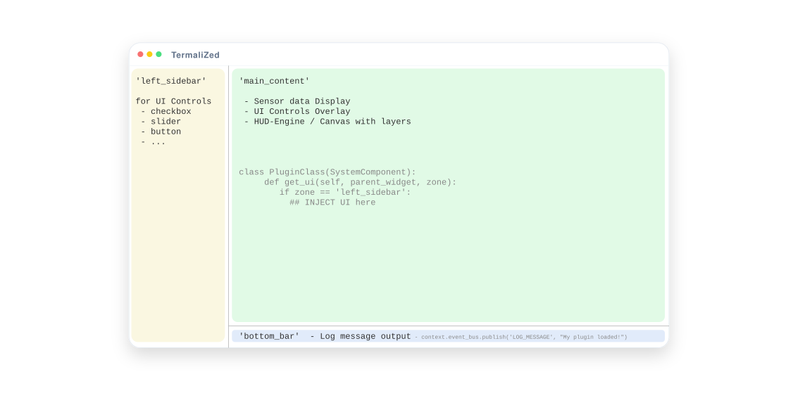

# ThermaliZed Plugin Guide

ThermaliZed is built around a **"Micro-Core"** architecture where functionality is extended via modular plugins. Plugins are automatically discovered and loaded on startup, hooking into the central **EventBus** or specialized **Pipelines** to process thermal data and inject new features.

The application interface is divided into three distinct zones, each serving a specific UX purpose:

1. **Main Content**: The primary canvas where the thermal image is rendered and interactive overlays are drawn.
2. **Left Sidebar**: A dedicated container for plugin-provided UI controls, such as sliders, toggles, and settings.
3. **Bottom Bar**: A persistent status area featuring a console-style log that displays system messages via the `LOG_MESSAGE` event.



## Core Concepts

All plugins reside in the `plugins/` directory and are dynamically discovered by the application on startup.

To be recognized, each plugin folder must contain an `__init__.py` file that defines a class named exactly **`PluginClass`**, inheriting from `SystemComponent` (`src.core.plugin_base`).

### The SystemComponent Lifecycle

Every plugin interacts with the application through three primary lifecycle hooks:

| Hook                         | Timing                            | Primary Purpose                                                          |
| :--------------------------- | :-------------------------------- | :----------------------------------------------------------------------- |
| `on_load(self, context)`     | During application initialization | Storing the `AppContext`, subscribing to events, and initializing state. |
| `get_ui(self, parent, zone)` | During UI construction            | Returning a `ttk.Frame` for specific UI zones (e.g., `left_sidebar`).    |
| `on_unload(self, context)`   | During application shutdown       | Unsubscribing from events, stopping background threads, and cleanup.     |

> [!TIP]
> Return `None` from `get_ui` if your plugin does not require a graphical interface.

### Minimal Plugin Example

A basic plugin that logs a message when loaded:

```python
# plugins/hello_world/__init__.py
from src.core.plugin_base import SystemComponent

class PluginClass(SystemComponent):
    def on_load(self, context):
        # Store context for future use (event bus, state, etc.)
        self.context = context

        # Publish a message to the console
        context.event_bus.publish('LOG_MESSAGE', "Hello, World! Plugin loaded!")
```

---

## The Event Bus

The `context.event_bus` serves as the central communication hub, allowing decoupled interaction between the application core and plugins. It supports three distinct communication patterns:

### 1. `publish(event_name, payload)` — Fire-and-Forget

Used to broadcast an event to all subscribers. The publisher does not track or receive any data back from listeners.

```python
self.context.event_bus.publish('LOG_MESSAGE', "Custom plugin event triggered.")
```

### 2. `subscribe(event_name, callback)` — Passive Listener

Used to listen for and react to specific system or plugin events.

```python
self.context.event_bus.subscribe('APP_QUIT', self._on_shutdown)
```

### 3. `pipeline(event_name, data, raw)` — Sequential Interceptor

A specialized pattern used for data processing (e.g., image manipulation). Subscribers receive the current state and can return a modified version for the next plugin in the chain.

- **Callback Args**: `(data, raw)` — `data` is the mutable payload; `raw` is the original source.
- **Return Value**: Return the modified `data` to update the pipeline, or `None` to skip modification.

> [!WARNING]
> **Execution Order**: Currently, pipeline subscribers are executed in the order they were discovered and loaded. Explicit control over execution priority is a planned feature for a future release.

---

### Standard System Events

The following events are broadcasted by the core and can be utilized by any plugin:

| Event Name         | Payload Type | Description                                                         |
| :----------------- | :----------- | :------------------------------------------------------------------ |
| `LOG_MESSAGE`      | `str`        | Text to be displayed in the bottom console log.                     |
| `FRAME_READY`      | `dict`       | Broadcasted when a new frame is captured from the device.           |
| `METADATA_READY`   | `dict`       | Contains calculated frame stats (min/max temps, center temp, etc.). |
| `COLORMAP_CHANGED` | `str`        | Triggered when the user selects a different colormap.               |
| `HUD_DRAW`         | `HUDContext` | The primary hook for drawing custom graphics onto the canvas.       |
| `APP_QUIT`         | `None`       | Triggered when the application is initiating its shutdown sequence. |

---

## The Three Pipeline Hooks

The data processing pipeline follows a linear sequence: **Raw Data** → **Image Generation** → **HUD Overlay**. Plugins can intercept and manipulate data at any of these stages.

---

### 1. `RAW_FRAME_PIPELINE`

**Timing**: Fires immediately after the 16-bit thermal array is assembled, but **before** any normalization or colormapping.

**Function Signature**:

```python
def callback(self, data: np.ndarray, raw: np.ndarray) -> np.ndarray | None:
```

| Argument | Type                  | Description                                              |
| :------- | :-------------------- | :------------------------------------------------------- |
| `data`   | `np.ndarray (uint16)` | The current mutable 16-bit thermal array (192x256).      |
| `raw`    | `np.ndarray (uint16)` | The original, immutable sensor array. **Do not mutate.** |

**Best Use**: Sensor-level adjustments like noise reduction, gamma correction, or thermal inversion. Return the modified array to update the pipeline.

---

### 2. `IMAGE_PIPELINE`

**Timing**: Fires after the 16-bit data has been normalized and colormapped into an 8-bit BGR image, but **before** it is rendered to the UI.

Plugins can hook here to completely remap the image that will be displayed using the raw 16bit data with there own logic.

**Function Signature**:

```python
def callback(self, data: np.ndarray, raw: dict) -> np.ndarray | None:
```

| Argument | Type                 | Description                                                    |
| :------- | :------------------- | :------------------------------------------------------------- |
| `data`   | `np.ndarray (uint8)` | The current 8-bit BGR image (192x256).                         |
| `raw`    | `dict`               | Metadata containing `'8bit'`, `'16bit'`, and `'thermal_info'`. |

> [!IMPORTANT]
> The `data` provided is the **source resolution** image. It will be scaled and zoomed to fit the canvas _after_ this hook finishes. This is the ideal place for custom colorization or edge-enhancement filters.

---

### 3. `HUD_DRAW`

**Timing**: Fired after the processed image has been positioned and scaled on the Tkinter canvas. This is the dedicated hook for all visual overlays (crosshairs, labels, etc.).

**Function Signature**:

```python
def callback(self, hud_context: dict) -> None:
```

| Key in `hud_context` | Type        | Description                                                    |
| :------------------- | :---------- | :------------------------------------------------------------- |
| `canvas`             | `tk.Canvas` | The active drawing surface.                                    |
| `bbox`               | `tuple`     | The `(x1, y1, x2, y2)` coordinates of the image on the canvas. |
| `raw_payload`        | `dict`      | The metadata dictionary (same as in `IMAGE_PIPELINE`).         |

```python
def _on_hud_draw(self, hud_context):
    canvas = hud_context['canvas']
    bbox   = hud_context['bbox']
    raw    = hud_context['raw_payload']

    # Access the 16-bit data for temperature math
    raw_16 = raw['16bit']

    # ... perform drawing on the canvas using bbox for positioning
```

> [!IMPORTANT]
> To go more in depth with the HUD engine please read the [HUD Engine](../docs/HUD_ENGINE.md) documentation and the specific tutorial in [./docs/HUD/README.md](../docs/HUD/README.md).

---

## Quick-Start Examples

### Example 1 — 16-bit pipeline modifier (no UI)

```python
# plugins/my_logger/__init__.py
import numpy as np
from src.core.plugin_base import SystemComponent

class PluginClass(SystemComponent):
    def on_load(self, context):
        self.context = context
        context.event_bus.subscribe('RAW_FRAME_PIPELINE', self._on_frame)
        context.event_bus.publish('LOG_MESSAGE', "MyLogger loaded!")

    def _on_frame(self, data, raw):
        print(f"Min: {np.min(raw)}, Max: {np.max(raw)}")
        return None  # pass-through
```

### Example 2 — HUD overlay with sensor coordinates

```python
# plugins/my_hud/__init__.py
import cv2
from src.core.plugin_base import SystemComponent
from src.utils.hud import HUDEngine, LAYER_MAIN

class PluginClass(SystemComponent):
    def __init__(self):
        super().__init__()
        self._hud = None

    def on_load(self, context):
        self.context = context
        context.event_bus.subscribe('HUD_DRAW', self._on_hud_draw)

    def _on_hud_draw(self, hud_context):
        canvas = hud_context.get('canvas')
        bbox   = hud_context.get('bbox')
        raw    = hud_context.get('raw_payload', {})
        raw_16 = raw.get('16bit')
        if not canvas or not bbox or raw_16 is None:
            return

        if self._hud is None or self._hud.canvas is not canvas:
            self._hud = HUDEngine(canvas)

        self._hud.clear()
        self._hud.set_sensor_mapping(bbox, raw_16.shape)

        _, _, min_loc, max_loc = cv2.minMaxLoc(raw_16)
        self._hud.draw_sensor_crosshair(max_loc[0], max_loc[1], color='red',   layer=LAYER_MAIN)
        self._hud.draw_sensor_crosshair(min_loc[0], min_loc[1], color='cyan',  layer=LAYER_MAIN)
```

## State & Parameters

The `context.state` object is a shared dictionary containing the application's configuration and real-time metadata.

| Key | Description |
| :--- | :--- |
| `params` | A dictionary of active processing parameters (e.g., `alpha`, `gamma`, `colormap`). |
| `infos` | Real-time frame statistics (e.g., `min_c`, `max_c`, `avg_c`, current `fps`). |
| `frozen_frame_data` | Contains static frame data if the app is in "Frozen" or "File" mode. |

> [!TIP]
> Changes made to `context.state['params']` are immediately reflected in the next frame processed by the pipeline.

---

## UI Components & Styling

To maintain a consistent aesthetic, plugins providing sidebar controls should inherit from **`BaseControlFrame`** (`src.core.components.controls.base`).

### `BaseControlFrame` Helpers
This class provides pre-styled methods for common layout needs:

*   `add_section_header(row, text)`: Adds a bolded section separator.
*   `add_label_slider(row, label, variable, from_, to, res, command)`: A standard slider with an integrated value label.
*   `add_dropdown(row, label, variable, values, command)`: A themed selection menu.

### Example: Sidebar UI
```python
from src.core.components.controls.base import BaseControlFrame

class MyPluginUI(BaseControlFrame):
    def __init__(self, parent, context, **kwargs):
        super().__init__(parent, context=context, **kwargs)
        
        # Link a UI variable to global state
        self.val = tk.DoubleVar(value=self.params.get('my_val', 1.0))
        
        self.add_section_header(0, "MY CUSTOM CONTROLS")
        self.add_label_slider(1, "Level:", self.val, 0.0, 5.0, 0.1, self._on_change)

    def _on_change(self, _=None):
        self.params['my_val'] = self.val.get()
```

---

## Useful Utilities

| Import Path | Purpose |
| :--- | :--- |
| `src.utils.functions.to_degrees_c(raw)` | Converts a TC001 uint16 raw value to Celsius (°C). |
| `src.utils.functions.to_raw(celsius)` | Converts a Celsius value back to a TC001 uint16 raw value. |
| `src.utils.constants.COLORMAPS` | A list of available OpenCV colormaps `(code, name)`. |
| `src.utils.constants.DEFAULT_PARAMS` | The default processing parameters for the application. |
