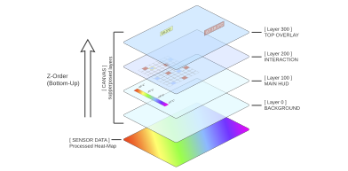

# HUD Engine — Part 1: Introduction

The **HUDEngine** is a high-performance, layer-aware drawing system designed specifically for the ThermaliZed thermal camera application. It sits on top of a standard Tkinter Canvas and solves three main problems:

1.  **Coordinate Complexity**: It handles the math of mapping small sensor pixels (e.g., 256x192) to a large, resizable canvas window.
2.  **Visual Depth**: It provides a "Layer" system (Z-indexing) so crosshairs always appear above background boxes.
3.  **Performance**: It uses aggressive memoization (caching) to ensure that re-drawing 100 items at 30 FPS doesn't lag the GUI.

The HUDEngine gives access to the canvas and HUD layers in the 'main_content' Zone :

---

## The Mental Model

When using the HUDEngine, you should think in terms of **Layers** and **Sensor Space**.

### 1. Layers (The "Z" Axis)

Canvas items are organized into a stack. Higher layer numbers are drawn on top of lower ones.

- **Thermal Image Area**: The processed heatmap (not managed by HUD layers, but the reference for them).
- **Background (0)**: Things behind the image (rarely used).
- **Main (100)**: Default layer. For most labels and crosshairs.
- **Interaction (200)**: For active UI elements like selection boxes.
- **Top (300)**: Debug info or critical alerts.

### 2. Sensor Space vs. Canvas Space

The `CoordMapper` acts as the bridge between the raw camera data and the visual window.

- **Canvas Space**: Standard pixels on your screen. `(0,0)` is the top-left of the canvas widget.
- **Sensor Space**: The "thermal" pixels. `(0,0)` is the top-left of the camera sensor.
- **The Magic**: You give the engine a sensor coordinate (e.g., `col 128, row 96`) and it automatically calculates exactly where that is on the screen, even if the window is zoomed or resized.

---

## Where does it live?

The engine is located in `src/utils/hud/`.

- `HUDEngine`: The main coordinator (in `core.py`).
- `CoordMapper`: The math brain (in `mapper.py`).
- `TickEngine`: The heartbeat for animations (in `interaction.py`).
- `library/`: A collection of drawing "recipes" (primitives and composites).

## Next Steps

In [Part 2: Drawing Basics](02-drawing-basics.md), we will learn how to actually put pixels on the screen using these concepts.
