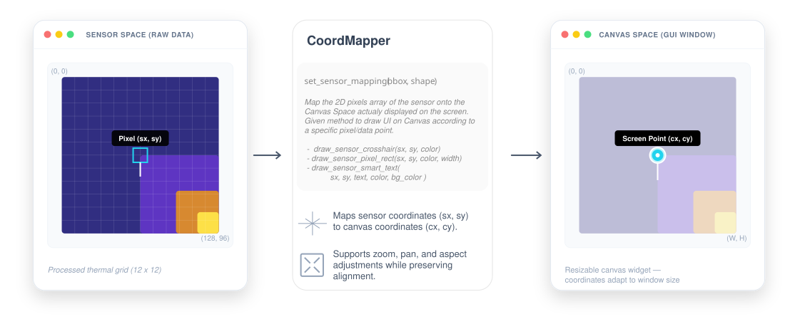

# HUD Engine — Developer Guide

> [!TIP]
> Looking for a tutorial? Check out the **[In-Depth HUD Tutorial Series](HUD/README.md)**.

A modular, layer-aware HUD drawing engine for Tkinter canvas overlays.

---

## Quickstart — Drawing Your First Temperature Label

```python
from src.utils.hud import HUDEngine
from src.core.plugin_base import SystemComponent

class PluginClass(SystemComponent):
    def on_load(self, context):
        # Subscribe to the HUD drawing hook
        context.event_bus.subscribe("HUD_DRAW", self._on_hud_draw)

    # Inside a HUD_DRAW callback:
    def _on_hud_draw(self, hud_context):
        canvas = hud_context["canvas"]
        bbox   = hud_context["bbox"]
        raw    = hud_context["raw_payload"]["16bit"]

        if self._hud is None or self._hud.canvas is not canvas:
            self._hud = HUDEngine(canvas)

        hud = self._hud
        hud.clear()
        hud.set_sensor_mapping(bbox, raw.shape)

        # Draw a gold label at sensor pixel (col=128, row=96)
        hud.draw_sensor_smart_text(
            128, 96,
            text="37.5 °C",
            color="#FFD700",
            bg_color=(0, 0, 0, 180),  # semi-transparent black
        )
```

---

## Package Structure

```
src/utils/hud/
├── __init__.py          ← Public API entry point
├── core.py              ← HUDEngine class
├── mapper.py            ← CoordMapper (sensor ↔ canvas)
├── interaction.py       ← TickEngine (async hover pipeline)
└── library/
    ├── primitives.py    ← create_text, create_rounded_rect, create_svg_icon
    ├── composites.py    ← create_crosshair, create_text_rect, create_smart_text
    └── thermal.py       ← create_sensor_pixel_rect, create_sensor_crosshair, ...
```

---

## Layer System

Canvas items are organised into **named layers** (integer z-index, multiples of 100).

| Constant            | Value | Typical use                                    |
| ------------------- | ----- | ---------------------------------------------- |
| `LAYER_BACKGROUND`  | 0     | Background fills, scale bars                   |
| `LAYER_MAIN`        | 100   | Default — crosshairs, temperature labels       |
| `LAYER_INTERACTION` | 200   | Selection borders (pixel picker)               |
| `LAYER_TOP`         | 300   | Always-on-top items (debugging overlays, etc.) |

```python
from src.utils.hud import HUDEngine, LAYER_INTERACTION

hud.draw_sensor_pixel_rect(sx, sy, color="#FFD700", layer=LAYER_INTERACTION)
```

### Selective Clearing

```python
hud.clear()                         # clear ALL layers
hud.clear(layer=LAYER_INTERACTION)  # clear only the interaction layer
```

This is the key trick used by `interactive_canvas`: the hover border lives as a raw canvas item (never in `HUDEngine`), while the selection border lives in `LAYER_INTERACTION`. Calling `hud.clear(layer=LAYER_INTERACTION)` removes the selection without touching the hover.

---

## Sync vs Async Pipelines

### Sync Pipeline — `HUD_DRAW` event

Fired by the renderer after each camera frame is placed on the canvas. Use this for data-driven overlays that need the latest sensor values.

```python
context.event_bus.subscribe("HUD_DRAW", self._on_hud_draw)
```

### Async Pipeline — `TickEngine`

The `TickEngine` provides a high-frequency redraw loop (default 30 FPS) that is **independent of the camera's frame rate**. This is essential for:

- **Hover Effects**: Keeping a selection box fluid even when the camera is frozen.
- **Animations**: Rendering smooth transitions or pulsing markers.
- **UI Feedback**: Responding to mouse movement without waiting for the next thermal frame.

---

## When and Where to Initialize

Because the `TickEngine` requires a reference to the **Tkinter Canvas**, it cannot be initialized in `on_load()`. The recommended pattern is **Lazy Initialization** inside your first `HUD_DRAW` callback.

### Initialization Workflow:

1.  **Capture the Canvas**: Wait for the first `HUD_DRAW` event to get the `canvas` reference.
2.  **Instantiate once**: Create the `TickEngine` and store it in your plugin instance.
3.  **Start the Loop**: Call `.start()` immediately.
4.  **Register Redraw**: Use `.on_tick()` to register your drawing function.
5.  **Signal Changes**: Call `.mark_dirty()` from event handlers (like mouse motion) to trigger the next tick.

---

## Full Example: Hover Interaction

```python
from src.utils.hud import TickEngine

class PluginClass(SystemComponent):
    def __init__(self):
        super().__init__()
        self._tick = None
        self._mouse_pos = (0, 0)

    def on_load(self, context):
        context.event_bus.subscribe("HUD_DRAW", self._on_hud_draw)

    def _on_hud_draw(self, hud_context):
        canvas = hud_context["canvas"]

        # Lazy Init: Wait until canvas is available
        if self._tick is None or self._tick.canvas is not canvas:
            # INIT TickEngine once
            self._tick = TickEngine(canvas, fps=30)
            self._tick.on_tick(self._draw_hover)
            self._tick.start()

            # Bind mouse events to trigger ticks
            canvas.bind("<Motion>", self._on_motion, add="+")

    def _on_motion(self, event):
        self._mouse_pos = (event.x, event.y)
        # As mouse pos change, mark_dirty() to tell the engine to redraw on the next tick
        if self._tick:
            self._tick.mark_dirty()

    def _draw_hover(self):
        # DRAW what you want
        # Executed 30 times per second ONLY if dirty ( via mark_dirty() )
        # Use raw canvas methods or a HUDEngine layer
        pass

    def on_unload(self, context):
        # CLEANUP: Always stop the loop to prevent memory leaks
        if self._tick:
            self._tick.stop()
```

---

## Performance Notes

The `TickEngine` is highly efficient. It uses `canvas.after()` to schedule ticks and only executes your callback if `mark_dirty()` was called. If the mouse isn't moving and no animations are active, the CPU overhead is near zero.

> [!CAUTION]
> Always call `tick.stop()` in your plugin's `on_unload` method. If you don't, the `after()` loop will continue running in the background indefinitely, even after the plugin is removed.

---

## Coordinate Mapping Concepts

Understanding the two coordinate systems is critical for accurate HUD placement.

| System | Context | Origin (0,0) | Bounds (TC001) |
| :--- | :--- | :--- | :--- |
| **Sensor Space** (`sx`, `sy`) | The raw thermal data array. | Top-Left of sensor. | `256 x 192` |
| **Canvas Space** (`cx`, `cy`) | The user's screen (Tkinter widget). | Top-Left of window. | Variable (Zoomed) |

`HUDEngine` exposes a `mapper` attribute (a `CoordMapper` instance) that handles these conversions. You **must** call `set_sensor_mapping(bbox, sensor_shape)` on each `HUD_DRAW` to update the zoom level and offsets.



```python
# 1. Automatic: Use sensor-aware drawing methods
hud.draw_sensor_crosshair(sx=128, sy=96, color="gold")

# 2. Manual: Get the exact center of a pixel in screen coordinates
cx, cy = hud.sensor_to_canvas(sx, sy)

# 3. Manual: Get the (x1, y1, x2, y2) bounds of a sensor pixel on screen
# Useful for drawing pixel-perfect borders or selections.
px, py, px2, py2 = hud.mapper.get_pixel_bounds(sx, sy)

# 4. Interaction: Convert a click back to a sensor pixel (returns None if outside)
pixel = hud.canvas_to_sensor(event.x, event.y)
```

---

## The Replay Pattern (Responsive UI)

When a user resizes the window, the thermal image shifts position and scale. To keep your HUD perfectly aligned without complex event bindings, use the **Replay Pattern**:

1.  **Register**: Pass your main drawing function to `hud.finalize(self.my_draw_logic)`.
2.  **Automatic Replay**: The `HUDEngine` stores a reference to this function and executes it automatically whenever `hud.update()` is called (e.g., by the system during window resizing).

```python
def _on_hud_draw(self, hud_context):
    # ... setup logic ...
    if self._hud is None:
        self._hud = HUDEngine(canvas)
        # Register the drawing function once
        self._hud.finalize(self._my_draw_logic)
    
    # Trigger the drawing logic
    self._my_draw_logic()

def _my_draw_logic(self):
    self._hud.clear()
    # ... draw sensor items ...
```

---

## Hybrid Overlays (Performance)

For high-performance interactions like **hover effects**, the recommended pattern is a **Hybrid Overlay**:

*   **Persistent Layer (`HUDEngine`)**: Used for items that change only when a new camera frame arrives (crosshairs, min/max markers).
*   **Transient Layer (Raw Canvas)**: Used for items that move at high frequency (mouse hover cursor). Use `TickEngine` to manage these directly on the canvas.

**Benefit**: This allows the mouse cursor to move at 60 FPS without forcing the entire `HUDEngine` (which might have dozens of complex labels) to clear and redraw on every movement.

---

## Public API Reference

### `HUDEngine`

| Method                                                      | Description                             |
| ----------------------------------------------------------- | --------------------------------------- |
| `clear(layer=None)`                                         | Remove canvas items (all layers or one) |
| `set_sensor_mapping(bbox, shape)`                           | Configure coord transform               |
| `sensor_to_canvas(sx, sy)`                                  | Sensor → canvas coords                  |
| `canvas_to_sensor(cx, cy)`                                  | Canvas → sensor pixel                   |
| `draw_text(x, y, text, color, ...)`                         | Primitive text                          |
| `draw_rounded_rect(x1, y1, x2, y2, radius, fill_rgba, ...)` | Alpha rect                              |
| `draw_svg_icon(x, y, filepath, ...)`                        | SVG icon (Tk 9+)                        |
| `draw_crosshair(cx, cy, color, ...)`                        | Four-arm crosshair                      |
| `draw_text_rect(x, y, text, color, bg_color, ...)`          | Text + background                       |
| `draw_smart_text(x, y, text, color, ...)`                   | Edge-clamped label                      |
| `draw_sensor_pixel_rect(sx, sy, color, ...)`                | Pixel border (sensor coords)            |
| `draw_sensor_crosshair(sx, sy, color, ...)`                 | Crosshair (sensor coords)               |
| `draw_sensor_smart_text(sx, sy, text, color, ...)`          | Label (sensor coords)                   |
| `finalize(draw_fn)`                                         | Register resize hook                    |
| `update()`                                                  | Replay the registered draw function     |

All drawing methods accept an optional `layer: int` kwarg (default `LAYER_MAIN = 100`).

### `TickEngine`

| Method                  | Description                            |
| ----------------------- | -------------------------------------- |
| `start()`               | Begin the after() loop                 |
| `stop()`                | Stop on the next iteration             |
| `mark_dirty()`          | Request a redraw on the next tick      |
| `on_tick(callback)`     | Register a zero-arg callback           |
| `remove_tick(callback)` | Unregister a callback                  |
| `is_dirty`              | Property — True if a redraw is pending |

---

## Performance Tips

### Use sensor-mapped methods for data overlays

`draw_sensor_crosshair` and `draw_sensor_smart_text` handle the coordinate transform internally so plugin code stays clean.

### Composites vs Primitives

- **Use composites** (`draw_smart_text`, `draw_text_rect`) for most overlays — they handle edge clamping, background sizing, and z-ordering automatically.
- **Use primitives** (`draw_text`, `draw_rounded_rect`) only when you need fine-grained control (e.g. a custom layout that doesn't fit the composite API).

### Frame deduplication

`HUDEngine` deduplicates identical drawing calls within the same frame via `_frame_registry`. Calling `draw_crosshair(128, 96, "red")` twice in one frame creates only one canvas item.

### PIL image memoisation

`draw_rounded_rect` caches PIL images by `(w, h, radius, fill, outline)` in `_rect_cache` across frames. At 30 FPS, a label that doesn't change geometry never re-creates a PIL image.

---

## Handling Mouse Clicks on Sensor Pixels

```python
def _on_click(self, event: tk.Event) -> None:
    pixel = self._hud.canvas_to_sensor(event.x, event.y)
    if pixel is not None:
        col, row = pixel
        raw_val  = self._raw_16bit[row, col]
        print(f"Clicked pixel ({col}, {row}) = {raw_val}")
```

`canvas_to_sensor` returns `None` when the click is outside the rendered image area, so no bounds checking is needed.
